## 🦜🔗 LLMOps Showcase — LangChain Documentation Helper

<div align="center">

**An end‑to‑end GenAI pipeline: ingestion → vectorstore → RAG backend → Streamlit UI → Cloud Run CI/CD**

[](https://www.python.org/downloads/)
[](https://tavily.com/)
[](https://cloud.google.com/vertex-ai)
[](https://www.trychroma.com/)
[](https://pinecone.io/)
[](https://ai.google.dev/)
[](https://langchain.com/)
[](https://streamlit.io/)
[](https://cloud.google.com/run)

</div>

<br>

## 📚 0. Table of Contents
<details>
  <summary><strong>Expand to view contents</strong></summary>
<br>

- [🦜 LLMOps Showcase — LangChain Documentation Helper](#-llmops-showcase--langchain-documentation-helper)
- [📚 0. Table of Contents](#-0-table-of-contents)
- [🎯 1. Project Overview](#-1-project-overview)
- [🚀 2. Quick Start \& UI Usage](#-2-quick-start--ui-usage)
  - [2.1 Quick Start (Using the Pre‑built `chroma_db/`)](#21-quick-start-using-the-prebuilt-chroma_db)
  - [2.2 Streamlit UI Usage](#22-streamlit-ui-usage)
  - [2.3 Optional: Try the Cloud‑Hosted Version (If Available)](#23-optional-try-the-cloudhosted-version-if-available)
- [📁 3. Repository Structure](#-3-repository-structure)
- [🧩 4. Architecture](#-4-architecture)
  - [4.1 Project Structure (Modules \& System Flow)](#41-project-structure-modules--system-flow)
  - [4.2 Application Flow (Runtime Interaction)](#42-application-flow-runtime-interaction)
- [🔎 5. Logging](#-5-logging)
- [🔐 6. Credentials \& Environment Variables](#-6-credentials--environment-variables)
- [🛠️ 7. Development](#️-7-development)
- [🧪 8. Testing](#-8-testing)
- [☁️ 9. Deployment](#️-9-deployment)
  - [9.1 CI/CD with GitHub Actions](#91-cicd-with-github-actions)
  - [9.2 Cloud Run Service Account Permissions](#92-cloud-run-service-account-permissions)
  - [9.3 Accessing the Deployed Application](#93-accessing-the-deployed-application)
- [🔮 10. Future Work](#-10-future-work)

</details>

<br>

## 🎯 1. Project Overview

The **LangChain Documentation Helper** is a fully‑engineered Retrieval‑Augmented Generation (RAG) application that functions as a *slim, self‑hosted version of* [chat.langchain.com](https://chat.langchain.com/).  
It provides accurate, source‑grounded answers to questions about LangChain documentation through a deterministic LCEL‑based RAG pipeline, supported by a clean modular architecture and modern GenAI engineering practices.

The system demonstrates the complete lifecycle of a production‑ready GenAI application:  
from **web crawling and documentation ingestion**—specifically targeting the official [LangChain Python documentation](https://docs.langchain.com/oss/python/langchain/overview) as the knowledge source, to **embedding and vectorstore construction**, to **retrieval‑augmented reasoning**, and finally to an interactive **Streamlit chat interface**.  
The project further showcases practical operational concerns such as **logging**, **testing**, **containerization**, and **automated deployment** to **Google Cloud Run** via CI/CD.

Overall, this repository is designed to illustrate how a real‑world GenAI application can be built, structured, deployed, and maintained—highlighting clarity, observability, and end‑to‑end engineering discipline.

### Tech Stack

<div align="center">

| Component | Technology | Description |
|-----------|------------|-------------|
| 🌐 **Web Crawling** | Tavily | Performs targeted web search and documentation retrieval |
| 🧬 **Embeddings** | Vertex AI Embeddings | Generates high‑dimensional vector representations of text |
| 🧊 **Vector Database** | Chroma / Pinecone | Stores and retrieves embeddings for similarity‑based search |
| 🤖 **Chat Model** | Gemini | Produces grounded responses using retrieved context |
| 🧠 **AI Framework** | LangChain | Coordinates ingestion, retrieval, and the RAG pipeline |
| 🖥️ **Frontend UI** | Streamlit | Provides an interactive chat interface for end users |
| 🧪 **Testing** | Ruff, Pytest | Ensures code quality through linting and unit tests |
| 🐳 **Containerization** | Docker | Packages the application into reproducible containers |
| 🔄 **CI/CD** | GitHub Actions | Automates linting, testing, building, and deployment |
| ☁️ **Serverless Hosting** | Cloud Run | Runs the containerized app on a fully managed platform |

</div>

<br>

## 🚀 2. Quick Start & UI Usage

### 2.1 Quick Start (Using the Pre‑built `chroma_db/`)

The fastest way to run the application is to use the **pre‑generated Chroma vectorstore** included in this repository.  
This allows you to launch the Streamlit UI immediately without running the ingestion pipeline.

#### **Step 1 — Clone the repository**

```bash
git clone https://github.com/kpma1120/llmops-e2e-langchain.git
cd llmops-e2e-langchain
```

The repository already includes:

- `chroma_db/` — a ready‑to‑use vectorstore  
- `docker-compose.yml` — Streamlit + backend containers  
- `.env.example` — environment variable template  

#### **Step 2 — Create a Google Cloud service account**

In the Google Cloud Console, create a new service account and grant it the required IAM roles as shown below.

<div align="center">
  
  <p><em>Service account configured with required IAM roles</em></p>
</div>

After creating the service account, generate a key and download the JSON credentials file.  
Place it under the `credentials/` directory (e.g., `credentials/service-account.json`).  
This file will be referenced through the `GOOGLE_APPLICATION_CREDENTIALS` environment variable.

#### **Step 3 — Prepare environment variables**

Copy the example environment file:

```bash
cp .env.example .env
```

Then update the path to your Google Cloud service account JSON file in:

```
GOOGLE_APPLICATION_CREDENTIALS=credentials/service-account.json
```

No other environment variables need to be modified at this stage.

#### **Step 4 — Build the Docker images**

```bash
docker compose build
```

This builds:

- the backend RAG service  
- the Streamlit UI  

Both services mount the pre‑built `chroma_db/` folder as a shared volume.

#### **Step 5 — Start the application**

```bash
docker compose up
```

Once the containers start, the Streamlit UI will be available at:

```
http://localhost:8501
```

---

### 2.2 Streamlit UI Usage

<div align="center">
  
  <p><em>Sample query and response displayed in the Streamlit interface</em></p>
</div>

The Streamlit UI provides a simple chat‑based interface for interacting with the LangChain documentation helper.

#### **Chat Input**
At the bottom of the page, you will find the chat box labeled:

```
Ask a question about LangChain…
```

This is where you can enter any query related to the LangChain documentation.

#### **Query Response**
After submitting a query:

- The application retrieves relevant documentation chunks from the vectorstore  
- Generates an answer using the configured LLM  
- Displays both the **answer** and the corresponding **sources**  

The sources section includes metadata such as document titles, URLs, and chunk identifiers, allowing you to trace exactly where the retrieved information came from.

#### **Session Controls**
On the left sidebar, under the **Session** section, there is a **Clear chat** button.  
This resets the Streamlit session state and clears the conversation history, allowing you to start a new query session without refreshing the page.

---

### 2.3 Optional: Try the Cloud‑Hosted Version (If Available)

A Cloud Run–hosted version of this application is also deployed as part of the CI/CD pipeline.  
If the service is currently active, you can access the live Streamlit app here:

**[https://llm-app-668245685616.us-east1.run.app](https://llm-app-668245685616.us-east1.run.app)**

This endpoint allows you to experience the final deployed version without running Docker locally.

> **Note:**  
> This URL may change or become unavailable in the future depending on cloud resource limits and account lifecycle.  
> If the link is inactive, please run the application locally using the steps in **2.1 Quick Start**.

<br>

## 📁 3. Repository Structure
```
llmops-e2e-langchain/
├── .github/workflows/       # GitHub Actions CI/CD configuration
│   └── deploy.yml
├── .streamlit/              # Streamlit UI theme configuration
│   └── config.toml
├── chroma_db/               # Pre-generated Chroma vectorstore for quick start
├── screenshots/             # Screenshot images used in README.md
├── .dockerignore            # Files and directories excluded from Docker build context
├── .env.example             # Environment variable template for local development
├── .gitignore               # Git ignore rules for the repository
├── Dockerfile               # Container image definition for the application
├── README.md                # Project documentation
├── app.py                   # Streamlit application entry point
├── backend.py               # Core backend logic (RAG pipeline, retrieval, LLM calls)
├── docker-compose.yml       # Container setup for local development
├── ingestion.py             # Document ingestion and vectorstore building pipeline
├── logger.py                # Custom logging utilities
├── pyproject.toml           # Tooling configuration (Ruff, Pytest, Coverage)
├── requirements-dev.txt     # Development dependencies (full local development and testing environment)
├── requirements-test.txt    # Testing dependencies (especially for lint and test jobs)
├── requirements.txt         # Runtime dependencies for the application
├── test.py                  # Basic test suite for backend logic
└── vectorstore.py           # Vectorstore abstraction layer (Chroma / Pinecone)
```

<br>

## 🧩 4. Architecture

### 4.1 Project Structure (Modules & System Flow)

The diagram below illustrates the abstract end‑to‑end pipeline — from ingestion to cloud deployment — together with the concrete modules that implement each stage.

```mermaid
flowchart LR
    %% ============================
    %% High-level pipeline (main flow)
    %% ============================
    INGESTION[Ingestion<br/>tavily → Vertex AI embeddings → Chroma/Pinecone]
        --> BACKEND[Backend<br/>Gemini chat model + LangChain RAG]
        --> FRONTEND[Frontend App<br/>Streamlit]
        --> TESTING[Testing<br/>ruff + pytest]
        --> DOCKER[Containerization<br/>Docker]
        --> CICD[CI/CD<br/>GitHub Actions]
        --> CLOUD[Cloud Serverless Container<br/>Google Cloud Run]

    %% ============================
    %% Module-level mapping
    %% ============================
    subgraph Ingestion_Layer
        ING[ingestion.py]
        VS[vectorstore.py]
        VS --> ING
    end

    subgraph Backend_Layer
        BE[backend.py]
        VS --> BE
    end

    subgraph Frontend_Layer
        APP[app.py]
        BE --> APP
    end

    subgraph Logging_Layer
        LOG[logger.py]
        LOG --> ING
        LOG --> VS
    end

    subgraph Testing_Layer
        TEST[test.py]
        BE --> TEST
    end

    %% Connect layers to high-level pipeline
    INGESTION -. maps to .-> ING
    BACKEND -. maps to .-> BE
    FRONTEND -. maps to .-> APP
    TESTING -. maps to .-> TEST
    %% Logging is intentionally NOT part of main pipeline
    LOGGING -. maps to .-> LOG
```



### Key idea  
A two‑layer view:  
- **Top layer** shows the conceptual pipeline:
```
Ingestion → Backend → Frontend → Testing → Docker → CI/CD → Cloud
```
- **Bottom layer** maps each stage to the actual Python modules in this repository:
```
logger → ingestion
logger → vectorstore
vectorstore → ingestion
vectorstore → backend
backend → app
backend → test
```
This keeps the architecture both intuitive and implementation‑aligned.

---

### 4.2 Application Flow (Runtime Interaction)

The following diagram shows how a user query flows through the system at runtime, with an emphasis on the relationship between the retriever, vector store, and relevant documents.

<details>
  <summary><strong>Click to expand application flow diagram</strong></summary>


</details>

### Key idea  
The backend orchestrates retrieval and generation:  
- The **Retriever** queries the **Vector Store**  
- The vector store returns **Relevant Docs**  
- The LLM synthesizes an **Answer + Sources**  
- Streamlit renders the final response  

This diagram captures the essential RAG loop in a clean, minimal form.

<br>

## 🔎 5. Logging

The project includes a lightweight, visually expressive logging utility used primarily during ingestion and vectorstore operations. It emphasizes **clarity**, **color‑coded feedback**, and **semantic log levels** to make local development and debugging more intuitive without relying on a full logging framework.

### Log Levels & Visual Styling

Each log function corresponds to a clear semantic level, paired with distinct colors and emojis for quick visual recognition.

| Level | Function | Style | Description |
|-------|----------|--------|-------------|
| **Info** | `log_info()` | Cyan + ℹ️ | General operational messages |
| **Success** | `log_success()` | Green + ✅ | Completed steps or positive outcomes |
| **Warning** | `log_warning()` | Yellow + ⚠️ | Non‑critical issues or soft alerts |
| **Error** | `log_error()` | Red + ❌ | Failures or exceptions |
| **Header** | `log_header()` | Bold purple + 🚀 | Section separators for readability |

All styling is implemented using ANSI escape codes defined in the `Colors` class, ensuring consistent formatting across terminals without external dependencies.

<br>

## 🔐 6. Credentials & Environment Variables

The project separates configuration into two environments:

- **Local development** — values loaded from `.env` and service account files under `credentials/`
- **CI/CD** — values injected through **GitHub Actions Secrets**, never stored in the repository

Both environments use the same variable names, but the source of truth differs depending on where the application runs.

| Variable / Secret | Local (.env) | CI/CD (Secrets) | Purpose |
|-------------------|--------------|--------------------------|---------|
| **GOOGLE_APPLICATION_CREDENTIALS** | ✔️ Yes | ❌ No | Path to local Google Cloud service account JSON. |
| **GCP_SA_KEY** | ❌ No | ✔️ Yes | Base64‑encoded Google Cloud service account JSON for CI/CD authentication. |
| **GCP_PROJECT_ID** | ❌ No | ✔️ Yes | Google Cloud project ID for Artifact Registry & Cloud Run. |
| **TAVILY_API_KEY** | ✔️ Yes | ❌ No | Tavily API key for ingestion web crawling. |
| **VECTORSTORE_PROVIDER** | ✔️ Yes | ✔️ Yes | Selects vector store backend: `chroma` or `pinecone`. |
| **PINECONE_API_KEY** | ✔️ Yes | ✔️ Yes | Pinecone API key for vectorstore operations. |
| **PINECONE_INDEX_NAME** | ✔️ Yes | ✔️ Yes | Pinecone index name (only used when provider = pinecone). |
| **CHROMA_PERSIST_DIR** | ✔️ Yes | ✔️ Yes | Directory for ChromaDB persistence (local or CI tests). |

<br>

## 🛠️ 7. Development

Local development follows a simple setup flow: create a Python environment, configure credentials, prepare environment variables, and run the ingestion + application components.

1. **Create a Python 3.13 virtual environment**  
   Use either `venv` or `conda` to create a virtual environment for `python 3.13.*`, then install development dependencies:  
   ```
   pip install -r requirements-dev.txt
   ```

2. **Create a Google Cloud service account**  
   Assign the required IAM roles, generate a JSON key, and place it under `credentials/`  
   (same as Step 2 in 2.1 Quick Start).

3. **Configure environment variables**  
   Copy `.env.example` → `.env` and fill in all parameters, especially choose which vectorstore you want via
   `VECTORSTORE_PROVIDER` (`chroma` or `pinecone`).

4. **Run the ingestion pipeline**
   Execute the ingestion script to load documents, generate embeddings, and build the vector store:
   ```
   python ingestion.py
   ```
   Once the pipeline completes, you should see color‑coded logs indicating each step of the process and a final success message, similar to the example below.
   <div align="center">
     
     <p><em>Example console output from a successful ingestion run</em></p>
   </div>

5. **(Optional) Test backend logic**  
   ```
   python backend.py
   ```
   This verifies that `run_llm()` and vectorstore retrieval work as expected.

6. **Start the Streamlit application**  
   ```
   streamlit run app.py
   ```
   Visit `http://localhost:8501` to interact with the local UI.

This workflow provides a complete local environment for ingestion, retrieval, and UI testing with minimal setup.

<br>

## 🧪 8. Testing

Local testing is configured through `pyproject.toml` and a single test module `test.py`.  
The setup covers linting, unit testing, and coverage reporting, matching the same workflow used in CI/CD.

### Local Test Configuration  
- **Ruff** is configured in `pyproject.toml` for linting (PEP8, imports, upgrades, bugbear).  
- **Pytest** is configured with verbose output, coverage reporting, and automatic export of results to `test-results/junit.xml`.  
- **test.py** uses fixtures and monkeypatching to mock the RAG pipeline (`rag_chain`, `refine_chain`, `retriever`) and validate `run_llm()` behavior under different scenarios.

### Running Tests Locally  
Linting and unit tests can be executed directly from the command line:

```
ruff check .
pytest
```

### Test Outputs  
Running pytest produces two key outputs:

- **Console output** — immediate pass/fail results with coverage summary  
- **JUnit XML report** — exported automatically to `test-results/junit.xml` for CI integration

### CI/CD Integration  
The same lint and test steps run automatically in GitHub Actions, ensuring consistent validation across local and cloud environments. Further details are covered in the Deployment section.

<br>

## ☁️ 9. Deployment

Deployment covers two parts: running the containerized application locally using Docker (see Step 4 and Step 5 in 2.1 Quick Start), and deploying it automatically through GitHub Actions to Google Cloud Run.

### 9.1 CI/CD with GitHub Actions

Automated deployment is handled by `deploy.yml`, which uses GitHub Actions Secrets (see Section 6) and runs three jobs:

- **lint** — runs Ruff checks  
- **test** — runs pytest with coverage and exports `test-results/junit.xml` as a downloadable artifact  
- **build-and-deploy** — builds the Docker image, pushes it to Artifact Registry, and deploys it to Cloud Run

<div align="center">
  
  <p><em>Successful GitHub Actions CI/CD pipeline run</em></p>
</div>

The **test-results** artifact can be downloaded directly from the workflow run for inspection.

After deployment, Cloud Run hosts the latest version of the application:

<div align="center">
  
  <p><em>Successfully deployed Cloud Run service</em></p>
</div>

---

### 9.2 Cloud Run Service Account Permissions

Cloud Run uses a default compute service account (typically  
`{project_number}-compute@developer.gserviceaccount.com`).  
To enable backend calls to Vertex AI, grant this service account the **Vertex AI User** role (`roles/aiplatform.user`).

<div align="center">
  
  <p><em>Cloud Run service account configured with the required Vertex AI permissions</em></p>
</div>

---

### 9.3 Accessing the Deployed Application

After deployment, Cloud Run exposes a public URL in the format:

```
https://{service-name}-{project-number}.{region}.run.app
```

For this project, the deployed service is available at:

```
https://llm-app-668245685616.us-east1.run.app
```

Open the URL to confirm the Streamlit application is running successfully.  
This completes the full workflow from ingestion → backend → UI → CI/CD → Cloud Run.

<br>

## 🔮 10. Future Work

Planned enhancements focus on improving observability, developer experience, and the overall quality of the RAG pipeline.

- **Monitoring Enhancements** — Integrate Evidently AI for data drift, embedding drift, and model performance monitoring.  
- **Logging Improvements** — Explore `loguru` + `structlog` for structured, production‑grade logging.  
- **Retrieval Transparency** — Improve visibility into retrieved chunks to help users understand how answers are formed.  
- **Tracing Enhancements** — Add LangSmith tracing for end‑to‑end request inspection and pipeline debugging.
